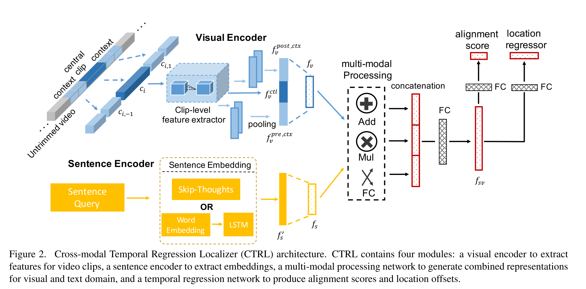
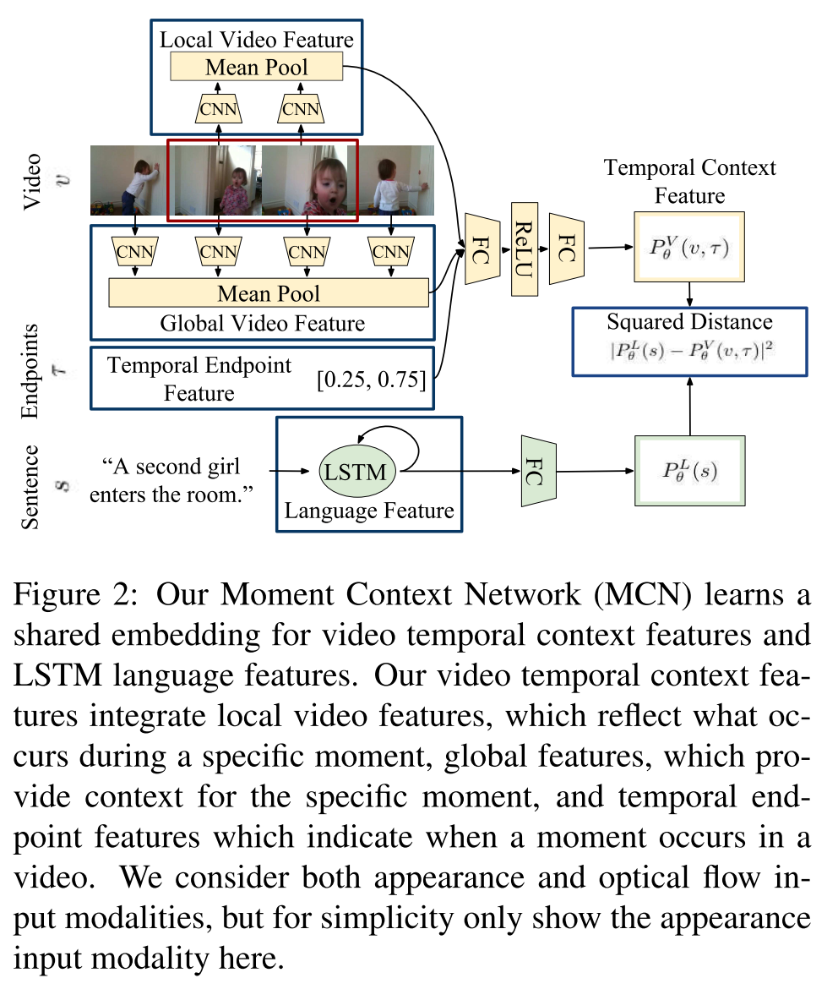

# Video-Moment-Retrieval-Papers
Summary of the papers related to video moment retrieval / video grounding / video moment localization ...

* This stream is to identify the clips related to a given sentence in a given video.

* [review blog 1](https://blog.csdn.net/qq_39388410/article/details/107316185)

* [review blog 2](https://zhuanlan.zhihu.com/p/101555506)

* [review bolg 3](https://zhuanlan.zhihu.com/p/67002279?from_voters_page=true)

# 2017
The beginning of this stream

* - [TALL Temporal Activity Localization via Language Query](http://openaccess.thecvf.com/content_iccv_2017/html/Gao_TALL_Temporal_Activity_ICCV_2017_paper.html) `ICCV 2017`.

* - [Localizing Moments in Video with Natural Language](https://openaccess.thecvf.com/content_iccv_2017/html/Hendricks_Localizing_Moments_in_ICCV_2017_paper.html) `ICCV2017`.

# 2018

* - [Cross-modal Moment Localization in Videos](https://dl.acm.org/doi/abs/10.1145/3240508.3240549) `MM 2018`.

* - [Attentive Moment Retrieval in Videos](https://dl.acm.org/doi/abs/10.1145/3209978.3210003?casa_token=ZxROouILgG4AAAAA:_xPwkaKYbwslcQnqEbrj7c4oZImYqDIVbtD0U4DJeHpKNzTknTd5qu4w5wK8NoVClmebtXU3InjS) `SIGIR 18`.

* - [Temporally Grounding Natural Sentence in Video](https://aclanthology.org/D18-1015.pdf) `EMNLP 2018`

# 2019

* - [To Find Where You Talk: Temporal Sentence Localization in Video with Attention Based Location Regression](https://ojs.aaai.org/index.php/AAAI/article/view/4950) `AAAI 2019`

* - [Cross-Modal Video Moment Retrieval with Spatial and Language-Temporal Attention](https://dl.acm.org/doi/abs/10.1145/3323873.3325019) `ICMR 2019`

* - [Cross-Modal Interaction Networks for Query-Based Moment Retrieval in Videos](https://dl.acm.org/doi/abs/10.1145/3331184.3331235) `SIGIR 2019`

* - [Semantic Proposal for Activity Localization in Videos via Sentence Query](https://ojs.aaai.org/index.php/AAAI/article/view/4830) `AAAI 2019`

* - [Read, Watch, and Move Reinforcement Learning for Temporally Grounding Natural Language Descriptions in Videos] `AAAI 2019`

* - [MAN Moment Alignment Network for Natural Language Moment Retrieval via Iterative Graph Adjustment](https://openaccess.thecvf.com/content_CVPR_2019/html/Zhang_MAN_Moment_Alignment_Network_for_Natural_Language_Moment_Retrieval_via_CVPR_2019_paper.html) `CVPR 2019`
 
* - [Language-Driven Temporal Activity Localization A Semantic Matching Reinforcement Learning Model] `CVPR 2019`

* - [Weakly Supervised Video Moment Retrieval From Text Queries] `CVPR 2019`

# 2020

* - [Learning 2D Temporal Adjacent Networks for Moment Localization with Natural Language](https://ojs.aaai.org/index.php/AAAI/article/view/6984) `AAAI 2020`

* - [Adversarial Video Moment Retrieval by Jointly Modeling Ranking and Localization](https://dl.acm.org/doi/10.1145/3394171.3413841) `MM 20`

* - [Moment Retrieval via Cross-Modal Interaction Networks With Query Reconstruction] `TIP 2020`

* - [Adversarial Video Moment Retrieval by Jointly Modeling Ranking and Localization] `MM 2020`

# 2021

* - `MMRG` [Multi-Modal Relational Graph for Cross-Modal Video Moment Retrieval](http://openaccess.thecvf.com/content/CVPR2021/html/Zeng_Multi-Modal_Relational_Graph_for_Cross-Modal_Video_Moment_Retrieval_CVPR_2021_paper.html) `CVPR 2021`

* - `LoGAN` [LoGAN: Latent Graph Co-Attention Network for Weakly-Supervised Video Moment Retrieval](https://openaccess.thecvf.com/content/WACV2021/html/Tan_LoGAN_Latent_Graph_Co-Attention_Network_for_Weakly-Supervised_Video_Moment_Retrieval_WACV_2021_paper.html) `WACV 2021` 

* - [A Closer Look at Temporal Sentence Grounding in Videos Datasets and Metrics](https://arxiv.org/abs/2101.09028) `arxiv 2021`

* - `IVG` [Interventional Video Grounding with Dual Contrastive Learning](https://openaccess.thecvf.com/content/CVPR2021/html/Nan_Interventional_Video_Grounding_With_Dual_Contrastive_Learning_CVPR_2021_paper.html) `CVPR 2021`

* - `VCMR` [Video Corpus Moment Retrieval with Contrastive Learning](https://arxiv.org/abs/2105.06247) `SIGIR 2021`

* - `TCN+DCM` [Deconfounded Video Moment Retrieval with Causal Intervention](https://arxiv.org/abs/2106.01534) `SIGIR 2021`

* - `CI-MHA` [Cross Interaction Network for Natural Language Guided Video Moment Retrieval](https://assets.amazon.science/3e/b2/355ae2424b088335d5c0a4085e93/cross-interaction-network-for-natural-language-guided-video-moment-retrieval.pdf) `SIGIR 2021`

* - `mTVR` [mTVR: Multilingual Moment Retrieval in Videos](https://arxiv.org/abs/2108.00061) `ACL 2021`

* - `FVMR` [Fast Video Moment Retrieval](https://openaccess.thecvf.com/content/ICCV2021/html/Gao_Fast_Video_Moment_Retrieval_ICCV_2021_paper.html) `ICCV 2021`

* - `CONQUER` [CONQUER: Contextual Query-aware Ranking for Video Corpus Moment Retrieval](https://dl.acm.org/doi/abs/10.1145/3474085.3475281) `MM2021`

* - `I2N-I3D` [Interaction-Integrated Network for Natural Language Moment Localization](https://ieeexplore.ieee.org/abstract/document/9334438/) `TIP 2021`

* - `BPNet` [Boundary Proposal Network for Two-Stage Natural Language Video Localization](https://www.aaai.org/AAAI21Papers/AAAI-6267.XiaoS.pdf) `AAAI 2021`

* - `CABL` [Context-Aware Biaffine Localizing Network for Temporal Sentence Grounding](http://openaccess.thecvf.com/content/CVPR2021/html/Liu_Context-Aware_Biaffine_Localizing_Network_for_Temporal_Sentence_Grounding_CVPR_2021_paper.html) `CVPR 2021`

* - [Thinking Fast and Slow: Efficient Text-to-Visual Retrieval With Transformers](https://openaccess.thecvf.com/content/CVPR2021/html/Miech_Thinking_Fast_and_Slow_Efficient_Text-to-Visual_Retrieval_With_Transformers_CVPR_2021_paper.html) `CVPR 2021`

* - `LOCFORMER` [LocFormer: Enabling Transformers to Perform Temporal Moment Localization on Long Untrimmed Videos With a Feature Sampling Approach](https://arxiv.org/abs/2112.10066) `arxiv 2021`

* - [Weakly-Supervised Video Object Grounding via Causal Intervention]() `arxiv 2021`

# Dataset

- [ActivityNet Captions](http://cs.stanford.edu/people/ranjaykrishna/densevid/)
- [Charades-STA](<https://allenai.org/plato/charades/>)
- [DiDeMo](<https://github.com/LisaAnne/LocalizingMoments>)
- [TACoS](http://www.coli.uni-saarland.de/projects/smile/page.php?id=software)

- [Many datasets](https://prior.allenai.org/datasets)

New

- [mTVR: Multilingual Moment Retrieval in Videos](https://arxiv.org/abs/2108.00061) `ACL 2021`
- [MAD: A Scalable Dataset for Language Grounding in Videos from Movie Audio Descriptions](https://arxiv.org/abs/2112.00431) `arxiv 2021`
- [AssistSR: Affordance-centric Question-driven Video Segment Retrieval](https://arxiv.org/pdf/2111.15050.pdf) `arxiv 2021`

# Benchmark Results % (2021)

#### ActivityNet Captions

|                 | R\@1 IoU\@0.1 | R\@1 IoU\@0.3 | R\@1 IoU\@0.5 | R\@1 IoU\@0.7 | R\@5 IoU\@0.1 | R\@5 IoU\@0.3 | R\@5 IoU\@0.5 | R@\5 IoU\@0.7 | Note |
| :-------------: | :---------: | :---------: | :---------: | :---------: | :---------: | :---------: | :---------: | :---------: | :----: |
| IVG     | - | 63.22 | 43.84 | 27.10 | - | - | - | - | |
| TCN+DCM | - | - | 44.9 | 27.7 | - | - | - | - | |
| CI-MHA  | - | 61.49 | 43.97 | 25.13 | - | - | - | - | |
| FVMR    | - | 60.63 | 45.00 | 26.85 | - | 86.11 | 77.42 | 61.04 | |
| BPNet   | - | 58.98 | 42.07 | 24.69 | - | - | - | - | |
| CABL    | - | 66.34 | 48.12 | 27.60 | - | 88.91 | 79.32 | 63.41 | |
| LOCFORMER | - | 60.61 | 43.74 | 27.04 | - | - | - | - | |
#### Charades-STA

|         | R\@1 IoU\@0.1 | R\@1 IoU\@0.3 | R\@1 IoU\@0.5 | R\@1 IoU\@0.7 | R\@5 IoU\@0.1 | R\@5 IoU\@0.3 | R\@5 IoU\@0.5 | R@\5 IoU\@0.7 | Note |
| :-----: | :---------: | :---------: | :---------: | :---------: | :---------: | :---------: | :---------: | :---------: | :----: |
| MMRG    | 88.27 | 71.60 | 44.25 | - | 92.35 | 87.67 | 60.22 | - | |
| LoGAN   | - | 51.67 | 34.68 | 14.54 | - | 92.74 | 74.30 | 39.11 | weakly-supervised |
| IVG     | - | 67.63 | 50.24 | 32.88 | - | - | - | - | |
| TCN+DCM | - | - | 59.7 | 34.4 | - | - | - | - | I3D |
| CI-MHA  | - | 69.87 | 54.68 | 35.27 | - | - | - | - | |
| FVMR    | - | - | 55.01 | 33.74 | - | - | 89.17 | 57.24 | I3D |
| I2N-I3D | - | - | 52.28 | 31.32 | - | - | 80.65 | 54.17 | |
| BPNet | - | 65.48 | 50.75 | 31.64 | - | - | - | - | |
| LOCFORMER | - | 71.88 | 58.52 | 38.51 | - | - | - | - | |

#### DiDeMo

|                | R\@1 IoU\@0.1 | R\@1 IoU\@0.3 | R\@1 IoU\@0.5 | R\@1 IoU\@0.7 | R\@5 IoU\@0.1 | R\@5 IoU\@0.3 | R\@5 IoU\@0.5 | R@\5 IoU\@0.7 |
| :------------: | :---------: | :---------: | :---------: | :---------: | :---------: | :---------: | :---------: | :---------: |
| TCN+DCM | - | - | - | 37.5 | - | - | - | - | |

#### TACoS

|         | R\@1 IoU\@0.1 | R\@1 IoU\@0.3 | R\@1 IoU\@0.5 | R\@1 IoU\@0.7 | R\@5 IoU\@0.1 | R\@5 IoU\@0.3 | R\@5 IoU\@0.5 | R@\5 IoU\@0.7 | Note |
| :-----: | :---------: | :---------: | :---------: | :---------: | :---------: | :---------: | :---------: | :---------: | :----: |
| MMRG    | 85.34 | 57.83 | 39.28 | - | 84.37 | 78.38 | 56.34 | - | * the figures look strangely high |
| IVG     | 49.36 | 38.84 | 29.07 | 19.05 | - | - | - | - | |
| FVMR    | 53.12 | 41.48 | 29.12 | - | 78.12 | 64.53 | 50.00 | - | |
| I2N-I3D | - | 31.47 | 29.25 | - | - | 52.65 | 46.08 | - | |
| BPNet   | - | 25.96 | 20.96 | 14.08 | - | - | - | - | * the figures look strangely low |
| CABL    | 49.16 | 38.98 | 27.65 | - | 73.12 | 59.96 | 46.24 | - | |

* maybe the experiment setting is different

# Weakly-supervised methods

* - [Weakly Supervised Video Moment Retrieval From Text Queries](<https://arxiv.org/abs/1904.03282>) `CVPR 2019`
* - [Weakly-supervised spatio-temporally grounding natural sentence in video](https://www.aclweb.org/anthology/P19-1183.pdf) `ACL 2019` [[code]](https://github.com/JeffCHEN2017/WSSTG.git.)
* - [WSLLN: Weakly Supervised Natural Language Localization Networks](https://arxiv.org/abs/1909.00239) `EMNLP 2019`
* - [Weakly-Supervised Video Moment Retrieval via Semantic Completion Network](https://arxiv.org/pdf/1911.08199.pdf) `AAAI 2020`
* - [VLANet: Video-Language Alignment Network for Weakly-Supervised Video Moment Retrieval](https://www.ecva.net/papers/eccv_2020/papers_ECCV/papers/123730154.pdf) `ECCV 2020`
* - [Two-Stream Consensus Network for Weakly-Supervised Temporal Action Localization](https://arxiv.org/abs/2010.11594) `ECCV 2020`
* - [Regularized Two-Branch Proposal Networks for Weakly-Supervised Moment Retrieval in Videos](https://arxiv.org/abs/2008.08257) `MM 2020` [[code]](https://github.com/ikuinen/regularized_two-branch_proposal_network)
* - [Counterfactual Contrastive Learning for Weakly-Supervised Vision-Language Grounding](https://proceedings.neurips.cc/paper/2020/file/d27b95cac4c27feb850aaa4070cc4675-Paper.pdf) `NeruIPS 2020`

## Comparison of some weakly-supervised methods on Charades-STA

|         | R\@1 IoU\@0.1 | R\@1 IoU\@0.3 | R\@1 IoU\@0.5 | R\@1 IoU\@0.7 | R\@5 IoU\@0.1 | R\@5 IoU\@0.3 | R\@5 IoU\@0.5 | R@\5 IoU\@0.7 | Note |
| :-----: | :---------: | :---------: | :---------: | :---------: | :---------: | :---------: | :---------: | :---------: | :----: |
| LoGAN   | - | 51.67 | 34.68 | 14.54 | - | 92.74 | 74.30 | 39.11 | weakly-supervised |
| TGA     | - | 29.68 | 17.04 | 6.93 | - | 83.87 | 58.17 | 26.80 | weakly-supervised |
| SCN     | - | 42.96 | 23.58 | 9.97 | - | 95.56 | 71.80 | 28.87 | weakly-supervised |

`LoGAN`: Tan, Reuben, et al. "Logan: Latent graph co-attention network for weakly-supervised video moment retrieval." Proceedings of the IEEE/CVF Winter Conference on Applications of Computer Vision. 2021.

`TGA`: Niluthpol Chowdhury Mithun, Sujoy Paul, and Amit K Roy- Chowdhury. Weakly supervised video moment retrieval from text queries. In Proceedings ofthe IEEE Conference on Com- puter Vision and Pattern Recognition, pages 11592–11601, 2019.

`SCN`: Zhijie Lin, Zhou Zhao, Zhu Zhang, Qi Wang, and Huasheng Liu. Weakly-supervised video moment retrieval via semantic completion network. In Proceedings ofthe AAAI Conference on Artificial Intelligence, 2020.

# Benchmark Results % (2019 and before)

#### ActivityNet Captions

|                 | R\@1 IoU\@0.1 | R\@1 IoU\@0.3 | R\@1 IoU\@0.5 | R\@1 IoU\@0.7 | R\@5 IoU\@0.1 | R\@5 IoU\@0.3 | R\@5 IoU\@0.5 | R@\5 IoU\@0.7 | Note |
| :-------------: | :---------: | :---------: | :---------: | :---------: | :---------: | :---------: | :---------: | :---------: | :----: |
|       MCN       |    42.80    |    21.37    |    9.58     |      -      |      -      |      -      |      -      |      -      | |
|      CTRL       |    49.09    |    28.70    |    14.0     |      -      |      -      |      -      |      -      |      -      | |
|      ACRN       |    50.37    |    31.29    |    16.17    |      -      |      -      |      -      |      -      |      -      | |
|      QSPN       |      -      |    45.3     |    27.7     |    13.6     |      -      |    75.7     |    59.2     |    38.3     | |
|       TGN       |    70.06    |    45.51    |    28.47    |      -      |    79.10    |    57.32    |    44.20    |      -      | |
|      SCDM       |      -      |    54.80    |    36.75    |    19.86    |      -      |    77.29    |    64.99    |    41.53    | |
|       CBP       |      -      |    54.30    |    35.76    |    17.80    |      -      |    77.63    |    65.89    |    46.20    | |
|     TripNet     |      -      |    48.42    |    32.19    |    13.93    |      -      |      -      |      -      |      -      | RL |
|      ABLR       |    73.30    |    55.67    |    36.79    |      -      |      -      |      -      |      -      |      -      | RL |
|      ExCL       |      -      |    63.30    |    43.6     |    24.1     |      -      |      -      |      -      |      -      |  |
|      PFGA       |    75.25    |    51.28    |    33.04    |    19.26    |      -      |      -      |      -      |      -      |  |
| WSDEC-X(Weakly) |    62.7     |    42.0     |    23.3     |      -      |      -      |      -      |      -      |      -      |  |
| WSLLN (Weakly)  |    75.4     |    42.8     |    22.7     |      -      |      -      |      -      |      -      |      -      |  |

#### Charades-STA

|         | R\@1 IoU\@0.1 | R\@1 IoU\@0.3 | R\@1 IoU\@0.5 | R\@1 IoU\@0.7 | R\@5 IoU\@0.1 | R\@5 IoU\@0.3 | R\@5 IoU\@0.5 | R@\5 IoU\@0.7 | Note |
| :-----: | :---------: | :---------: | :---------: | :---------: | :---------: | :---------: | :---------: | :---------: | :----: |
|  CTRL   |      -      |      -      |    23.63    |    8.89     |      -      |      -      |    58.92    |    29.52    | |
|  ABLR   |      -      |      -      |    24.36    |    9.01     |      -      |      -      |      -      |      -      | |
|  SMRL   |      -      |      -      |    24.36    |    11.17    |      -      |      -      |    61.25    |    32.08    | |
|  ACL-K  |      -      |      -      |    30.48    |    12.20    |      -      |      -      |    64.84    |    35.13    | |
|   SAP   |      -      |      -      |    27.42    |    13.36    |      -      |      -      |    66.37    |    38.15    | |
|  QSPN   |      -      |    54.7     |    35.6     |    15.8     |      -      |    95.8     |    79.4     |    45.4     | |
|   MAN   |      -      |      -      |    46.53    |    22.72    |      -      |      -      |    86.23    |    53.72    | |
|  SCDM   |      -      |      -      |    54.44    |    33.43    |      -      |      -      |    74.43    |    58.08    | |
|   CBP   |      -      |      -      |    36.80    |    18.87    |      -      |      -      |    70.94    |    50.19    | |
| TripNet |      -      |    51.33    |    36.61    |    14.50    |      -      |      -      |      -      |      -      | RL |
|  ExCL   |      -      |    65.1     |    44.1     |    23.3     |      -      |      -      |      -      |      -      | RL |
|  PFGA   |      -      |    67.53    |    52.02    |    33.74    |      -      |      -      |      -      |      -      | |

#### DiDeMo

|                | R\@1 IoU\@0.1 | R\@1 IoU\@0.3 | R\@1 IoU\@0.5 | R\@1 IoU\@0.7 | R\@5 IoU\@0.1 | R\@5 IoU\@0.3 | R\@5 IoU\@0.5 | R@\5 IoU\@0.7 |
| :------------: | :---------: | :---------: | :---------: | :---------: | :---------: | :---------: | :---------: | :---------: |
|      TMN       |    22.92    |      -      |      -      |      -      |    76.08    |      -      |      -      |      -      |
|      MCN       |    28.10    |      -      |      -      |      -      |    78.21    |      -      |      -      |      -      |
|      TGN       |    28.23    |      -      |      -      |      -      |    79.26    |      -      |      -      |      -      |
|      MAN       |    27.02    |      -      |      -      |      -      |    81.70    |      -      |      -      |      -      |
| WSLLN (Weakly) |    19.4     |      -      |      -      |      -      |    54.4     |      -      |      -      |      -      |

#### TACoS

|         | R\@1 IoU\@0.1 | R\@1 IoU\@0.3 | R\@1 IoU\@0.5 | R\@1 IoU\@0.7 | R\@5 IoU\@0.1 | R\@5 IoU\@0.3 | R\@5 IoU\@0.5 | R@\5 IoU\@0.7 | Note |
| :-----: | :---------: | :---------: | :---------: | :---------: | :---------: | :---------: | :---------: | :---------: | :----: |
|   MCN   |    2.62     |    1.64     |    1.25     |      -      |    2.88     |    1.82     |    1.01     |      -      | |
|  CTRL   |    24.32    |    18.32    |    13.30    |      -      |    48.73    |    36.69    |    25.42    |      -      | |
|   TGN   |    41.87    |    21.77    |    18.90    |      -      |    53.40    |    39.06    |    31.02    |      -      | |
|  ACRN   |    24.22    |    19.52    |    14.62    |      -      |    47.42    |    34.97    |    24.88    |      -      | |
|  ACL-K  |    31.64    |    24.17    |    20.01    |      -      |    57.85    |    42.15    |    30.66    |      -      | |
|  SCDM   |      -      |    26.11    |    21.17    |      -      |      -      |    40.16    |    32.18    |      -      | |
|   CBP   |      -      |    27.31    |    24.79    |    19.10    |      -      |    43.64    |    37.40    |    25.59    | |
| TripNet |      -      |    23.95    |    19.17    |    9.52     |      -      |      -      |      -      |      -      | RL |
|  SMRL   |    26.51    |    20.25    |    15.95    |      -      |    50.01    |    38.47    |    27.84    |      -      | RL |
|  ABLR   |    34.7     |    19.5     |     9.4     |      -      |      -      |      -      |      -      |      -      | RL |
|  ExCL   |      -      |    45.5     |    28.0     |    14.6     |      -      |      -      |      -      |      -      | |
